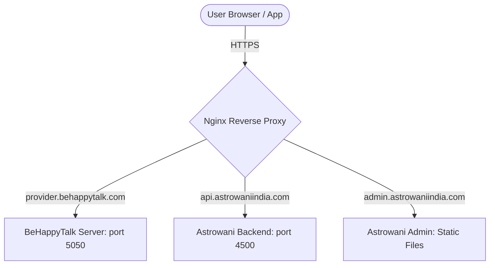

# Astrowani VPS Deployment Walkthrough & Guide

This guide describes how to deploy the **Astrowani Node.js Backend** and the **Astrowani Admin Dashboard** on your VPS without interfering with the existing **BeHappyTalk** deployment.

---

## Deployment Architecture Overview



To run Astrowani alongside BeHappyTalk on the same VPS, we use separate **Nginx Server Blocks** mapping different subdomains to their respective folders and local ports:
- **BeHappyTalk Backend**: Runs on port `5050` (`provider.behappytalk.com`)
- **Astrowani Backend**: Runs on port `4500` (`api.astrowaniindia.com` or similar)
- **Astrowani Admin Dashboard**: Served directly from static folder `/var/www/astrowani/admin/dist` (`admin.astrowaniindia.com` or similar)

---

## Prerequisites

1. **DNS A Records:** Point two subdomains (e.g., `api.astrowaniindia.com` and `admin.astrowaniindia.com`) to your VPS IP (`76.13.243.165` or your target VPS).
2. **VPS Access:** SSH access to your VPS with sudo privileges.
3. **PM2 & Nginx:** Already installed on your VPS (since BeHappyTalk is running, these are already present).

---

## Step 1: Prepare and Build the Admin Panel Locally

To prevent memory overload on the VPS during Vite compilation, build the React admin dashboard locally:

1. Open [astrowani-admin/.env](file:///d:/Projects/Astrowani/astrowani-admin/.env) and update the backend endpoint URL to your chosen backend subdomain:
   ```env
   VITE_API_URL=https://api.astrowaniindia.com
   ```
2. Open a terminal inside `d:\Projects\Astrowani\astrowani-admin` and run:
   ```bash
   npm install
   npm run build
   ```
   This will compile the production-ready assets into the `dist/` directory.

---

## Step 2: Upload Files to the VPS

### Option A: Via SCP (Secure Copy Protocol)

Run the following commands from your local machine to upload files directly to your VPS. Replace `username` and `76.13.243.165` with your actual VPS credentials and IP.

1. **Upload backend files:**
   ```bash
   # Create a temporary directory on the VPS for the upload
   ssh username@76.13.243.165 "mkdir -p ~/astrowani-temp/backend"
   
   # Copy backend files (excluding node_modules)
   scp -r d:\Projects\Astrowani\astrowani-backend\* username@76.13.243.165:~/astrowani-temp/backend/
   ```

2. **Upload Admin Build and Deployment Scripts:**
   ```bash
   # Create temporary directory for admin and deployment assets
   ssh username@76.13.243.165 "mkdir -p ~/astrowani-temp/admin ~/astrowani-temp/vps-deployment"
   
   # Copy admin dist folder
   scp -r d:\Projects\Astrowani\astrowani-admin\dist\* username@76.13.243.165:~/astrowani-temp/admin/
   
   # Copy deployment configuration and script files
   scp -r d:\Projects\Astrowani\vps-deployment\* username@76.13.243.165:~/astrowani-temp/vps-deployment/
   ```

### Option B: Via Git (Recommended)

1. Commit your local changes and push them to a private GitHub repository.
2. SSH into your VPS:
   ```bash
   ssh username@76.13.243.165
   ```
3. Clone your repository into a temporary folder:
   ```bash
   git clone https://github.com/astrowaniindia/Astrowani.git ~/astrowani-temp
   ```

---

## Step 3: Run the Deployment Automation Script

1. SSH into the VPS (if you haven't already):
   ```bash
   ssh username@76.13.243.165
   ```
2. Navigate to the uploaded deployment scripts folder:
   ```bash
   cd ~/astrowani-temp/vps-deployment/scripts
   ```
3. Make the script executable and run it:
   ```bash
   chmod +x deploy.sh
   ./deploy.sh
   ```
4. Follow the prompt instructions:
   * Enter your chosen **Backend Domain** (e.g. `api.astrowaniindia.com`).
   * Enter your chosen **Admin Domain** (e.g. `admin.astrowaniindia.com`).
   * Confirm if you want to run Certbot to automatically configure SSL/TLS (Select `y`).

---

## Step 4: Finalize Configurations

1. **Database Secrets:**
   Open the production `.env` file on the VPS:
   ```bash
   nano /var/www/astrowani/backend/.env
   ```
   Add your production credentials for Supabase, EnableX, Jyotisham API, and Firebase. Save changes and restart the backend PM2 process to apply them:
   ```bash
   pm2 restart astrowani-backend
   ```

2. **Copy the Admin dist folder:**
   Copy the pre-built admin panel files to the server serving directory:
   ```bash
   sudo mkdir -p /var/www/astrowani/admin/dist
   sudo cp -r ~/astrowani-temp/admin/* /var/www/astrowani/admin/dist/
   sudo chown -R www-data:www-data /var/www/astrowani/admin
   ```

---

## Step 5: Post-Deployment Verification

Verify that everything is running correctly using HTTPS.

1. **Verify Backend Access:**
   ```bash
   curl -I https://api.astrowaniindia.com
   ```
   *Expected Result:* `HTTP/1.1 200 OK` or appropriate API response headers.

2. **Verify Socket Server Connection:**
   Test WebSocket connection capabilities by querying the Socket.io route:
   ```bash
   curl -I https://api.astrowaniindia.com/socket.io/?EIO=4&transport=polling
   ```
   *Expected Result:* `HTTP/1.1 200 OK` from Socket.io connection broker.

3. **Verify Admin Dashboard:**
   Open `https://admin.astrowaniindia.com` in a browser. It should serve the React Admin dashboard smoothly.
